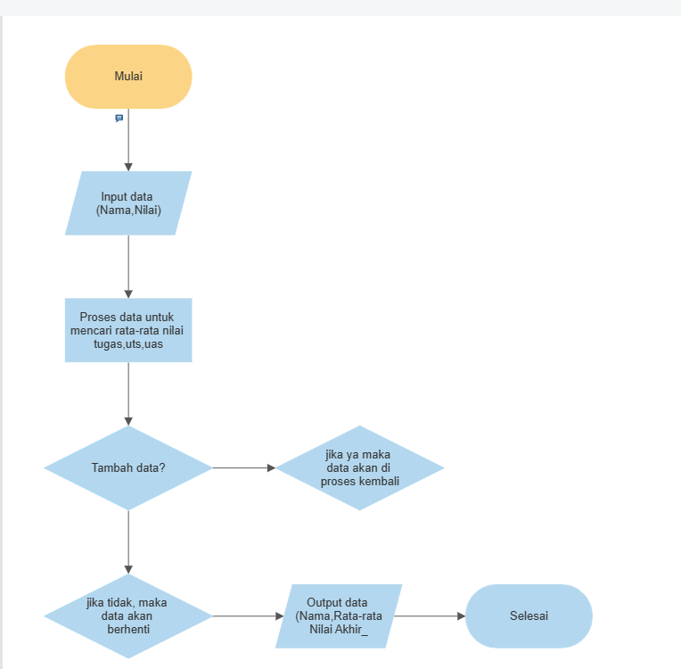
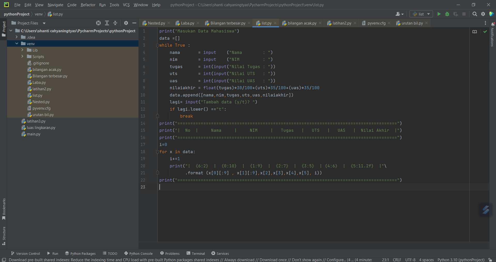

# Praktikum4

# Membuat Program sederhana Menambah Data ke Dalam Sebuah List dengan Rincian Sebagai Berikut
1. Program meminta memasukkan data sebanyak-banyaknya (gunakan perulangan)
2. Tampilkan pertanyaan untuk menambah data (y/t?), apabila menjawab tidak maka menampilkan daftar datanya
3. Nilai akhir diambil dari perhitungan Nilai(tugas:30%,uts:35%,uas35%)

Seperti yang di jelaskan pada Flowchart di bawah ini:
# Flowchart

Penjelasan Flowchart
1. Mulai
2. Di mulai dengan meng-input data (Nama,NIM,Nilai)
3. Data akan di proses dari ketiga komponen nilai tersebut untuk menghitung rata-rata nilai
4. Dalam proses tersebut akan ada pertanyaan apakah akan menambahkan data atau tidak (ya/tidak). Jika memilih (ya) maka data akan kembali keatas untuk memproses rata -rata nilai akhirnya
5. Jika memilih (tidak), maka data akan berhenti dan menampilkan daftar datanya
6. Hasil yang keluar menampilkan daftar data dan menampilkan rata-rata nilai akhir (Daftar Nama,NIM,Nilai Rata-rata nilai akhir)
7. Selesai 

Untuk lebih jelasnya bisa di lihat kode program di bawah ini :

-  Kode Program ini di buat Menggunakan aplikasi PyCharm

print("Masukan Data Mahasiswa")
data =[]
while True :
    nama       = input    ("Nama        : ")
    nim        = input    ("NIM         : ")
    tugas      = int(input("Nilai Tugas : "))
    uts        = int(input("Nilai UTS   : "))
    uas        = int(input("Nilai UAS   : "))
    nilaiakhir = float(tugas)*30/100+(uts)*35/100+(uas)*35/100
    data.append([nama,nim,tugas,uts,uas,nilaiakhir])
    lagi= input("Tambah data (y/t)? ")
    if lagi.lower() =="t"
        break
print("=====================================================================================")
print("|  No  |     Nama     |     NIM     |   Tugas   |   UTS   |   UAS   |  Nilai Akhir  |")
print("=====================================================================================")
i=0
for x in data:
    i+=1
    print("|  {6:2}  |  {0:10}  |  {1:9}  |  {2:7}  |  {3:5}  | {4:6}  |  {5:11.2f}  |"\
          .format (x[0][:9] , x[1][:9],x[2],x[3],x[4],x[5], i))
print("=====================================================================================")

- Kemudian anda bisa save dan Run Kode program tersebut
- Lalu akan keluaar hasil seperti ini 

Penjelasan program tersebut

Membuat list bernama data[]

lalu menggunakan perulangan while While True : Jika benar maka akan menjalankan kodingan selanjutnya yaitu menginput data-data

Untuk nama dan nim kita menggunakan fungsi input biasa

Untuk tugas,uts dan uas kita menggunakan fungsi int untuk menjadikannya integer

Dibagian nilaiakhir kita menggunakan fungsi float karena dapat digunakan sebagai argumen dan dapat juga melakukan operasi hitung secara langsung di dalam fungsi dengan bilangan bertipe integer atau sesama float.

Membuat kondisi dimana ingin Tambah Data (y/t)? jika y maka kondisi true dan akan mengulang ke awal untuk iput data selanjutnya. Jika t maka kondisi akan break, dan apabila kondisi break maka otomatis mengikuti syntax yang berada di luar perulangan seperti contoh yang ada diatas membuat list dengan rapih menggunakan kondisi string.format
